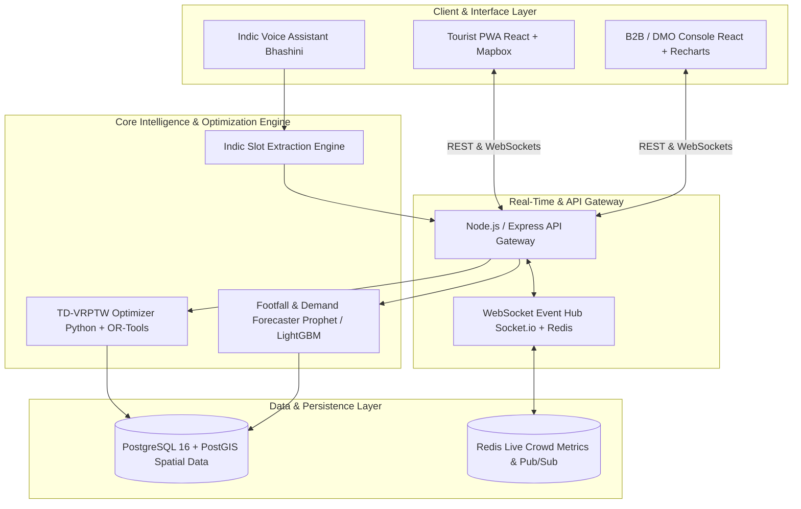

# SARATHI

**Smart Adaptive Routing & AI-Driven Hospitality Intelligence**

Real-time tourist route optimization, voice-based trip planning, and AI-powered demand forecasting for hotels and DMOs. Built for Smart India Hackathon.

## Architecture



## Features

- **Real-time Route Optimization** — TD-VRPTW solver with crowd and weather penalty multipliers
- **Indic Voice Interface** — Speech-to-intent via Bhashini API for regional language trip planning
- **14-Day Demand Forecasting** — Prophet + LightGBM occupancy models for hotels/DMOs
- **Live Rerouting** — WebSocket-based push notifications when waypoints become congested
- **B2B Analytics** — Footfall heatmaps, dynamic pricing, and inventory management

## Directory Structure

```
sarathi/
├── docker/
│   ├── docker-compose.yml
│   ├── Dockerfile.gateway
│   ├── Dockerfile.optimizer
│   ├── Dockerfile.client
│   └── Dockerfile.b2b
├── core-engine/
│   ├── app/
│   │   ├── api/v1/          # FastAPI routes
│   │   ├── optimizer/       # OR-Tools TD-VRPTW, cost matrix, crowd penalties
│   │   ├── ml/              # Prophet/LightGBM forecasting
│   │   └── nlp/             # Indic slot extraction, Bhashini client
│   ├── config.py
│   ├── main.py
│   └── requirements.txt
├── api-gateway/
│   ├── src/
│   │   ├── controllers/     # Express controllers
│   │   ├── routes/          # Tourist & B2B routes
│   │   ├── sockets/         # Socket.io live events
│   │   ├── middleware/      # Auth, rate limiting
│   │   └── server.js
│   └── package.json
├── apps/
│   ├── tourist-app/         # React/Vite/Mapbox PWA
│   └── b2b-console/         # React/Vite/Recharts dashboard
├── database/
│   ├── migrations/          # PostGIS schema migrations
│   └── seeders/             # Pilot circuit & hotel seed data
├── scripts/
│   ├── bootstrap_dev.sh
│   ├── mock_disruption_trigger.py
│   └── generate_mock_datasets.py
├── docs/
│   ├── architecture.md
│   └── sih-abstract.md
└── README.md
```

## Tech Stack

| Layer | Technology |
|-------|-----------|
| **Optimization** | OR-Tools (TD-VRPTW), OSRM |
| **Forecasting** | Prophet, LightGBM |
| **NLP** | Bhashini Indic ASR, regex/spacy slot extraction |
| **Backend Gateway** | Express, Socket.IO, Redis, rate limiting |
| **Frontend** | React, Vite, Mapbox GL, Tailwind CSS, Recharts |
| **Data** | PostgreSQL + PostGIS, asyncpg |
| **Deployment** | Docker, Docker Compose, Nginx |

## Quick Start

### Docker (Recommended)

```bash
# Start database + backend services
docker compose --profile backend up -d

# Start frontend apps
docker compose --profile frontend up -d
```

Services:
- API Gateway: http://localhost:5000
- Core Engine: http://localhost:8000
- Tourist App: http://localhost:8080
- B2B Console: http://localhost:8081

### Local Development

```bash
# Bootstrap all services
bash scripts/bootstrap_dev.sh

# Terminal 1: Core Engine
cd core-engine
uvicorn app.main:app --reload

# Terminal 2: API Gateway
cd api-gateway
npm run dev

# Terminal 3: Tourist App
cd apps/tourist-app
npm run dev

# Terminal 4: B2B Console
cd apps/b2b-console
npm run dev
```

## API Reference

### Core Engine (`:8000`)

| Endpoint | Method | Description |
|----------|--------|-------------|
| `/health` | GET | Service health check |
| `/api/v1/optimize` | POST | TD-VRPTW route optimization |
| `/api/v1/reroute` | POST | Real-time route adjustment |
| `/api/v1/demand-forecast` | POST | 14-day occupancy forecast |
| `/api/v1/crowd-level/{poi_id}` | GET | Real-time crowd prediction |
| `/api/v1/speech-intent` | POST | Indic voice → intent extraction |

### API Gateway (`:5000`)

| Endpoint | Method | Description |
|----------|--------|-------------|
| `/health` | GET | Gateway health check |
| `/api/tourist/optimize` | POST | Tourist route optimization |
| `/api/b2b/inventory` | GET | Hotel inventory forecast |
| `/api/reroute/simulate` | POST | Simulate crowd surge for demo |

### WebSocket Events

| Event | Direction | Description |
|-------|-----------|-------------|
| `subscribe_itinerary` | Client → Server | Subscribe to trip updates |
| `trigger_crowd_surge` | Client → Server | Trigger crowd surge event |
| `crowd_update` | Server → Client | Live congestion update |
| `reroute_recommendation` | Server → Client | Push new route suggestion |

## Database Schema

- `pois` — Spatial points of interest with capacity, dwell time, entry fees
- `hotels` — Accommodation inventory and pricing
- `crowd_logs` — Historical and real-time footfall with congestion ratio
- `weather_events` — Hazard alerts and severity polygons
- `itinerary_logs` — Trip planning and optimization history

Pilot circuit seeded: **Pune → Lonavala → Khandala → Mahabaleshwar → Panchgani**

## Scripts

| Script | Description |
|--------|-------------|
| `scripts/bootstrap_dev.sh` | One-command install & seed all services |
| `scripts/mock_disruption_trigger.py` | Simulate crowd/weather disruption events |
| `scripts/generate_mock_datasets.py` | Generate realistic POI & footfall data |

## Demo Flow

1. **Indic Voice Query → Dynamic Itinerary**: Speak in Marathi/Hindi to generate optimized routes
2. **Live Congestion Injection → Real-time Rerouting**: Run `python scripts/mock_disruption_trigger.py` to see instant reroute popups
3. **B2B Capacity Balancing**: DMO dashboard shows load balancing and dynamic pricing

## License

MIT
